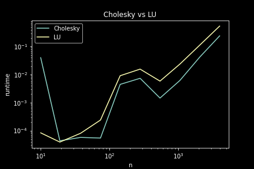

# Answers

Put any answers to questions in the assignment in this file, or any commentary you don't include in the code.

This is a markdown file (the `.md` extension gives it away). If you have never used markdown before, check out [this short guide](https://guides.github.com/features/mastering-markdown/).

## Problem 0

### Part(b) 

We can clearly see that cholesky runs faster than lu decomposition. This is expected because the matrices we are using are symmetric positive definite, which cholesky decomposition is designed for.

### Part(c) 
We should expect this method to perform faster than what we did in Homework 0. Especially when the matrix is large (let n be the dimension of matrix and power be k), in homework 0 we need to compute matrix square, which is O(n^3) for each step, let alone we need to compute log2(k) times. But now the complexity for "intermidiate" L^n is O(n), and we only need to compute matrix-vector multiplication twice, which is also just O(n^2). In conclusion, the eigenvalue decomposition method is a lot faster than egyptian style multiplication in homework 1. 

Considering that that Fibonacci numbers are integers, if we run our version of matrix_power, we will convert integers to floats. This will cause overflow faster than if we only use integer type, because we are using some bits inside of 64 bits to store the numbers after decimal, but we do not need to because they are all 0 as Fibonacci numbers are integers. So while the algorithm is fasters, we should expect that it runs into overflow issue faster than if we would just use integer type.

## Problem 1

### Part(a)

I will limit my discussion to only matmul_*** which are the functions I wrote and left matmul and dgemm alone, as the latter two are coded by the professionals who spent years of research and hardworking on coding, so those functions are encoded in very smart ways which of course surpass the functions I wrote in 10 seconds.

Now since python is uses a row operating system (which means it locates the row first and then index in a row as column, so it is like a two step procedure), it reaches its max speed if we could finish operations within that row before move on to the next row. Now it is clear from the plot that `matmul_ikj` is the fastest and `matmul_jki`is the slowest. The reason is the following. Recall what we are doing inside the loop is `A[i,j] = A[i,j] + B[i,k] * C[k,j]`. Observe that with `matmul_ikj`, the deepest loop first operats with j, which are the column index for `A[i,j]` and `C[k,j]`, which it takes advantage of the row operating system. Then the second loop is with variable k, which happens to be the column index for `B[i,k]`, so it is at an okay speed. The reason that it surpasess `matmul_kij` (which is the second fastest) is that the second loop for kij is looping with variable i, which happens to be the row index for `A[i,j]` and `'B[i,j]`, which means for `matmul_kij` the memory then have to switch between rows, but it is not as catastrophic as what we have for `matmul_jki`, which is the slowest, because it has to switch between rows every single operation it does.

### Part(c)

We can see clearly that strassen beats blocked method as promised by theoretical aspects. From theoretical analysis, strassen's algorithm has complexity O(n^2.81) < O(n^3), which is the complexity we are using in Part(b).

## Problem 2

### 2

Here I think a heatmap would be the best representation instead of plot of 3 vectors. Each column of corresponding to the different t in (10,100,1000) from left to right. For exmaple, the first column in the heatmap is when t = 10. The brighter the color, the greater the chance.

Now as we can see in the heatplot, when t = 10, we have that we should expect drunkard to be in fitst 6 blocks of the street. When t = 100, the drunkard has a chance to travael as far as 25^th block from the origin. When t = 1000, the drunkard has almost equal chance to be in any block of the street.

### 4
We can see that such vector v is an n dimention vector whose entries are all 0.2. This is very close to p(1000). In fact, the larger t is, the closer the two vectors are in euclidean norm.

## Feedback

This is just a screenshot that my code passed all the pytest criterion on my local machine.